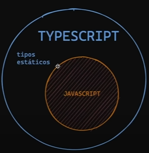
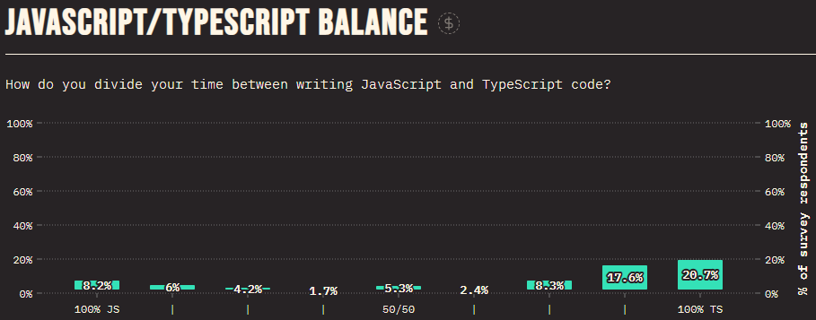

# Bienvenidos a la intro de Typescript :heart_eyes:

## ¿Qué es TS?

Typescript es JS con una sintaxis para tipos, es decir TS es un superset de JS

### Estado de **Stateofjs**

## ¿Porqué deberíamos aprenderlo?

1. Popularidad
1. Si hay más gente ocupando, hay más trabajo
1. Permite utilizar todos los frameworks y la mayoría de librerias de JS
1. Reduce en un 20% los errores de tipado JS

<h3 style="font-weight: bold; color: hotpink"> Temario TypeScript</h3>

- Tipos de Datos
- Arrow Functions
- Objects
- Interfaces
- Desestructuring

### Curiosidades

👀 Una expresión de función flecha es una alternativa compacta a una expresión de función tradicional
